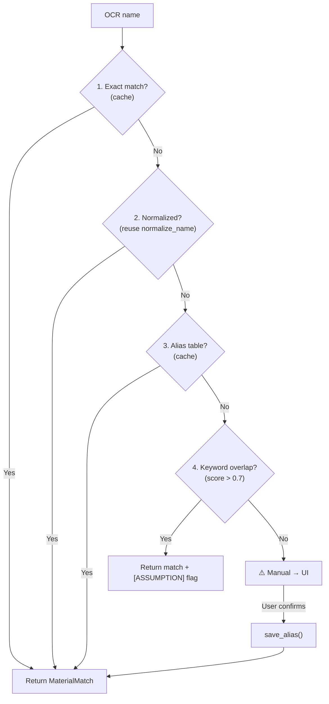
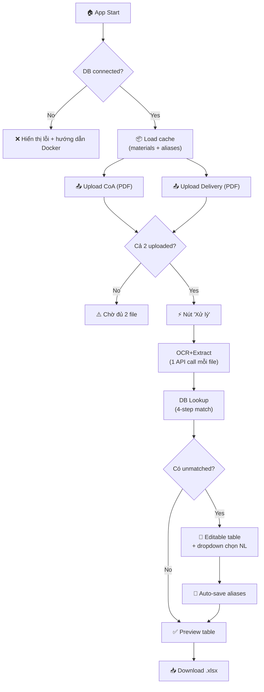

# 📋 Implementation Plan v2 — Hệ thống Nhập liệu Nguyên liệu Tự động

> **Mode: `[Architecture]`** | Tối ưu theo Agent.md: P0→P2 priority stack

---

## 🔒 P0 — Safety & Escalation Checklist

| Hạng mục | Trạng thái | Ghi chú |
|----------|-----------|---------|
| DB credentials hardcoded | ⚠️ `[ASSUMPTION]` sẽ dùng env vars | Chuyển sang `.env` + `python-dotenv` |
| Docker volume mount CSV | `[FACT]` port **5433:5432** (không phải 5432) | Đã xác nhận từ `docker-compose.yml` |
| Vertex AI credentials | `[FACT]` file `vertexai-496104-770c1482e704.json` tồn tại | `[ESTIMATE]` hạn ~06/2026 |
| Schema migration (alias table) | 🔴 **Escalation required** | Cần user confirm trước khi `CREATE TABLE` |
| PII/Synthetic data | `[FACT]` dữ liệu NL thật — không phải PII cá nhân | OK cho production |

> [!CAUTION]
> **Escalation Policy**: `CREATE TABLE material_aliases` = schema migration → **bắt buộc user xác nhận** trước khi chạy.

---

## 🎯 Mục tiêu & State Map

```
[FACT] Hiện có:
├── PostgreSQL (Docker) → pif_db → raw_materials (255 records)
├── Vertex AI credentials → Gemini Flash OCR
├── add_accounting_name.py → normalize_name() + keyword matching logic
└── CSV/XLSX reference files

[TARGET] Cần xây:
├── OCR Pipeline: PDF(CoA + Delivery) → Markdown → Structured JSON
├── DB Lookup: OCR name → ma_hc + ten_ke_toan (4-step matching)
├── Excel Export: openpyxl + conditional formatting (HSD < 90d = đỏ)
└── Streamlit UI: 2-file upload → preview → download .xlsx
```

---

## 🏗️ Kiến trúc (Diff từ v1)

```diff
 # Thay đổi chính so với plan v1:
-  Thư mục: D:\New folder (3)\Testing\
+  Thư mục: D:\New folder (3)\testOCR\   # [FACT] workspace hiện tại

-  Port DB: localhost:5432
+  Port DB: localhost:5433               # [FACT] docker-compose.yml map 5433:5432

+  Thêm: config.py                       # P0: tách credentials ra khỏi code
+  Thêm: models.py                       # P1: type contracts cho data flow

-  OCR + Extraction = 2 API calls riêng
+  OCR + Extraction = 1 multimodal call  # P2: giảm 50% token/API cost
```

### Cấu trúc thư mục (tối ưu)

```
D:\New folder (3)\testOCR\
├── app.py                  # Streamlit entry point
├── config.py               # [P0] Env vars, DB config, API config
├── models.py               # [P1] Pydantic/dataclass contracts
├── modules/
│   ├── __init__.py
│   ├── ocr_extractor.py    # [P2] Gộp OCR + Extraction = 1 module
│   ├── db_connector.py     # DB lookup + alias management
│   └── excel_generator.py  # openpyxl export
├── uploads/                # Temp PDF storage
├── outputs/                # Generated .xlsx
└── .env                    # [P0] Secrets (gitignore)
```

> [!IMPORTANT]
> **Diff vs v1**: Gộp `ocr_engine.py` + `data_extractor.py` → `ocr_extractor.py`. Lý do: Gemini Flash hỗ trợ multimodal input (PDF bytes trực tiếp) → **1 API call** vừa OCR vừa extract structured JSON. Tiết kiệm ~50% token cost và giảm latency.

---

## 📊 Output Contract (.xlsx) — Không thay đổi

| Cột | Nguồn | Ghi chú |
|-----|-------|---------|
| STT | Auto | — |
| Ngày nhập | `datetime.now()` | — |
| Mã HC | DB lookup | — |
| Tên NL | OCR (CoA) | — |
| Tên NL (kế toán) | DB lookup | — |
| Số lô | OCR (CoA) | — |
| Số lượng (kg) | OCR (Delivery) | — |
| Số pack về | OCR (Delivery) | — |
| Ngày SX | OCR (CoA) | — |
| HSD | OCR (CoA) | **Đỏ nếu < 90d** |
| Thời gian HSD còn lại | Calc | **Đỏ nếu < 90d** |

---

## 📦 Phase 1 — Config & Infrastructure `[~15 min]`

### Task 1.1: `config.py` — Tách credentials `[P0 Safety]`

```python
# config.py
import os
from dotenv import load_dotenv
load_dotenv()

DB_CONFIG = {
    "host": os.getenv("DB_HOST", "localhost"),
    "port": int(os.getenv("DB_PORT", "5433")),  # [FACT] 5433 không phải 5432
    "database": os.getenv("DB_NAME", "pif_db"),
    "user": os.getenv("DB_USER", "admin"),
    "password": os.getenv("DB_PASSWORD", "adminpassword"),
}

VERTEX_AI_PROJECT = os.getenv("VERTEX_PROJECT", "vertexai-496104")
VERTEX_AI_LOCATION = os.getenv("VERTEX_LOCATION", "us-central1")
CREDENTIAL_PATH = os.getenv("GOOGLE_CREDS", "vertexai-496104-770c1482e704.json")

# Model selection
OCR_MODEL = "gemini-2.0-flash"        # Multimodal: PDF → JSON trực tiếp
FUZZY_THRESHOLD = 0.7                  # Ngưỡng fuzzy match
EXPIRY_WARNING_DAYS = 90               # Ngưỡng cảnh báo HSD
```

### Task 1.2: Kiểm tra hạ tầng
- [ ] Docker Desktop running → `docker-compose up -d` từ `D:\New folder (3)`
- [ ] Verify DB: `localhost:5433` (⚠️ **port 5433**, không phải 5432)
- [ ] `pip install openpyxl psycopg2-binary python-dotenv pydantic`

### Task 1.3: `models.py` — Data Contracts `[P1 Fact]`

```python
# models.py — Type contracts cho toàn bộ data flow
from dataclasses import dataclass, field
from datetime import datetime
from typing import Optional

@dataclass
class CoARecord:
    """Dữ liệu trích xuất từ Certificate of Analysis"""
    ten_nguyen_lieu: str
    so_lo: str
    ngay_san_xuat: Optional[datetime] = None
    han_su_dung: Optional[datetime] = None

@dataclass
class DeliveryRecord:
    """Dữ liệu trích xuất từ Biên bản đơn hàng"""
    ten_nguyen_lieu: str
    so_luong_kg: Optional[float] = None
    so_pack: Optional[int] = None

@dataclass
class MaterialMatch:
    """Kết quả lookup từ DB"""
    ma_hc: str
    ten_nguyen_lieu_db: str
    ten_ke_toan: str
    confidence: str  # 'exact' | 'normalized' | 'alias' | 'fuzzy' | 'manual'
    score: float = 1.0

@dataclass
class OutputRecord:
    """Record hoàn chỉnh cho Excel export"""
    stt: int
    ngay_nhap: datetime
    ma_hc: str
    ten_nl: str
    ten_ke_toan: str
    so_lo: str
    so_luong_kg: Optional[float]
    so_pack: Optional[int]
    ngay_sx: Optional[datetime]
    hsd: Optional[datetime]
    thoi_gian_hsd_con_lai: Optional[int] = None  # số ngày
```

> [!TIP]
> **Dataclass contracts** đảm bảo mỗi module có input/output rõ ràng — dễ test, dễ debug theo evidence chain (Input→Transform→Output).

---

## 📦 Phase 2 — OCR + Extraction (Gộp) `[~30 min]`

### Task 2.1: `ocr_extractor.py` — Single API Call `[P2 Cost]`

**Tư duy kiến trúc**: Gemini Flash nhận PDF bytes trực tiếp (multimodal) → trả JSON. Không cần bước trung gian OCR→Markdown→Parse.

```python
# modules/ocr_extractor.py
from google import genai
from config import OCR_MODEL, VERTEX_AI_PROJECT, CREDENTIAL_PATH
from models import CoARecord, DeliveryRecord

# [P2] Prompt tối ưu token — chỉ giữ instruction cần thiết
COA_SYSTEM = """Extract from this CoA PDF. Return JSON array (1 object per page/product):
[{"ten_nguyen_lieu":"...", "so_lo":"...", "ngay_san_xuat":"DD/MM/YYYY", "han_su_dung":"DD/MM/YYYY"}]
Rules: dates→DD/MM/YYYY. If missing→null. Array even if 1 item."""

DELIVERY_SYSTEM = """Extract from this delivery document. Return JSON array:
[{"ten_nguyen_lieu":"...", "so_luong_kg":number_or_null, "so_pack":number_or_null}]"""

def extract_coa(pdf_bytes: bytes) -> list[CoARecord]:
    """PDF bytes → list[CoARecord]. 1 API call, multimodal."""
    # Upload PDF → Gemini Flash → parse JSON → list[CoARecord]
    ...

def extract_delivery(pdf_bytes: bytes) -> list[DeliveryRecord]:
    """PDF bytes → list[DeliveryRecord]. 1 API call, multimodal."""
    ...
```

### Task 2.2: Multi-page handling
- [ ] Gemini tự xử lý multi-page → prompt yêu cầu trả **JSON array**
- [ ] Mỗi phần tử = 1 nguyên liệu/trang

### Task 2.3: Date normalization
- [ ] Tái sử dụng regex parser hỗ trợ: `DD/MM/YYYY`, `YYYY-MM-DD`, `DD-Mon-YYYY`, `MM/DD/YYYY`
- [ ] Fallback: trả `None` + flag cho user nhập tay

---

## 📦 Phase 3 — Database Integration `[~45 min]`

### Task 3.1: `db_connector.py` — Connection + Cache

```python
# modules/db_connector.py
import psycopg2
from functools import lru_cache
from config import DB_CONFIG
from models import MaterialMatch

class DBConnector:
    """[P2] Singleton pattern + cache toàn bộ materials vào memory."""

    def __init__(self):
        self._conn = None
        self._materials_cache = None  # list[dict]
        self._alias_cache = None      # dict[str, MaterialMatch]

    def _get_conn(self):
        if not self._conn or self._conn.closed:
            self._conn = psycopg2.connect(**DB_CONFIG)
        return self._conn

    def load_cache(self):
        """Load toàn bộ raw_materials + aliases vào memory. Gọi 1 lần khi startup."""
        ...

    def lookup(self, ocr_name: str) -> MaterialMatch | None:
        """4-step matching pipeline (xem flowchart bên dưới)"""
        ...

    def save_alias(self, ocr_name: str, match: MaterialMatch):
        """[P0 Escalation] Lưu alias mới — chỉ INSERT, không UPDATE/DELETE."""
        ...
```

### Task 3.2: Matching Pipeline (4 bước — tối ưu từ v1)



> [!IMPORTANT]
> **Diff vs v1**: Bỏ `difflib.SequenceMatcher`, dùng **keyword overlap** (đã proven trong `add_accounting_name.py` line 120-136). `[FACT]` logic này đã hoạt động tốt với 255 records. Tái sử dụng `normalize_name()` trực tiếp.

### Task 3.3: Alias Table Schema `[P0 — Cần Escalation]`

```sql
-- ⚠️ ESCALATION: Schema migration — cần user confirm
CREATE TABLE IF NOT EXISTS material_aliases (
    id SERIAL PRIMARY KEY,
    ocr_name VARCHAR(500) NOT NULL UNIQUE,
    matched_ma_hc VARCHAR(50) NOT NULL,
    matched_ten_nl VARCHAR(500),
    confidence VARCHAR(20) DEFAULT 'manual',
    created_at TIMESTAMP DEFAULT NOW()
);
```

### Task 3.4: `sync_db.py` — DB maintenance
- [ ] Script đồng bộ DB từ CSV mới nhất
- [ ] Hàm `add_material()` bổ sung NL mới từ UI
- [ ] Log NL không match → export báo cáo

---

## 📦 Phase 4 — Excel Generation `[~30 min]`

### Task 4.1: `excel_generator.py`

```python
# modules/excel_generator.py
from openpyxl import Workbook
from openpyxl.styles import Font, PatternFill, Alignment, Border, Side
from models import OutputRecord
from config import EXPIRY_WARNING_DAYS

RED_FILL = PatternFill(start_color="FF0000", end_color="FF0000", fill_type="solid")
WHITE_FONT = Font(color="FFFFFF", bold=True)
HEADER_FILL = PatternFill(start_color="4472C4", end_color="4472C4", fill_type="solid")

COLUMNS = ["STT","Ngày nhập","Mã HC","Tên NL","Tên NL (kế toán)",
           "Số lô","Số lượng (kg)","Số pack về","Ngày SX","HSD","HSD còn lại"]

def generate_xlsx(records: list[OutputRecord], output_path: str) -> str:
    """Records → .xlsx with conditional formatting. Returns file path."""
    ...
```

### Task 4.2: Formatting rules
- [ ] Header: bold, `HEADER_FILL`, freeze row 1
- [ ] HSD < 90d → `RED_FILL` + `WHITE_FONT` cho cả cột HSD và HSD còn lại
- [ ] Auto-fit column widths
- [ ] Sheet name: `"Nhập NL {DD-MM-YYYY}"`

---

## 📦 Phase 5 — Streamlit UI `[~45 min]`

### Task 5.1: `app.py` — Flow



### Task 5.2: UI Components
- [ ] `st.file_uploader("CoA", type=["pdf"])` — file 1
- [ ] `st.file_uploader("Biên bản đơn hàng", type=["pdf"])` — file 2
- [ ] Validation: cả 2 file required → disable nút xử lý nếu thiếu
- [ ] `st.progress()` — tiến trình OCR
- [ ] `st.data_editor()` — editable table cho unmatched records
- [ ] `st.download_button()` — tải .xlsx
- [ ] DB health check on startup → hiển thị status

---

## ⚠️ Rủi ro & Khắc phục (P0 format)

| # | Rủi ro | Mức | Status | Giải pháp | Khắc phục |
|---|--------|-----|--------|-----------|-----------|
| R1 | OCR sai tên NL | 🟡 | `[ASSUMPTION]` Gemini Flash đủ tốt | User review trên UI | Log corrections → cải thiện prompt |
| R2 | Date format lạ | 🟡 | `[FACT]` đã có regex 5+ format | Multi-format parser | Fallback user nhập tay |
| R3 | Tên NL không match DB | 🟠 | `[FACT]` 255 records, ~40 codes từng miss | 4-step pipeline + alias | Auto-learn alias table |
| R4 | DB thiếu/sai records | 🟠 | `[FACT]` data từ CSV gốc | `sync_db.py` | Admin review + UI add |
| R5 | CoA scan kém | 🟠 | `[UNKNOWN]` chưa test | Gemini multimodal | Hỗ trợ JPG/PNG + re-upload |
| R6 | Docker down | 🟢 | `[FACT]` có health check | Startup validation | Retry + hướng dẫn UI |
| R7 | Vertex AI quota | 🟠 | `[ESTIMATE]` hạn 06/2026 | Startup credential check | Thông báo + hướng dẫn gia hạn |
| R8 | **Port DB sai** | 🔴 | `[FACT]` v1 ghi 5432, thực tế 5433 | **Đã sửa trong v2** | `config.py` centralized |

---

## 📅 Thứ tự triển khai

| Phase | Task | Thời gian | Phụ thuộc | Diff vs v1 |
|-------|------|-----------|-----------|------------|
| **1** | Config + Models + Infra | ~15 min | — | +`config.py`, +`models.py` |
| **2** | OCR+Extraction (gộp) | ~30 min | Phase 1 | **Gộp 2 module → 1, giảm 50% API calls** |
| **3** | DB Integration + Alias | ~45 min | Phase 1 | Reuse `normalize_name()` từ codebase |
| **4** | Excel Generation | ~30 min | Phase 2,3 | Không đổi |
| **5** | Streamlit UI | ~45 min | Phase 2-4 | +health check, +`st.data_editor` |

**Tổng: ~2.75 giờ** (giảm ~45 min so với v1 nhờ gộp OCR+Extraction)

---

## 🔧 Tech Stack

| Component | Technology | Ghi chú |
|-----------|-----------|---------|
| OCR + Extraction | Gemini 2.0 Flash (multimodal) | `[P2]` 1 call thay vì 2 |
| Database | PostgreSQL 15 (Docker, port 5433) | `[FACT]` đã sửa port |
| Excel | `openpyxl` | — |
| UI | Streamlit | `st.data_editor` cho editable |
| DB Connector | `psycopg2-binary` | — |
| Matching | Keyword overlap (stdlib) | `[FACT]` reuse từ `add_accounting_name.py` |
| Config | `python-dotenv` | `[P0]` tách secrets |
| Type Safety | `dataclasses` (stdlib) | `[P1]` contracts |

---

## 🔑 Tóm tắt cải tiến kiến trúc (v1 → v2)

| Hạng mục | v1 | v2 | Lý do (Agent.md) |
|----------|----|----|-------------------|
| Credentials | Hardcoded | `.env` + `config.py` | **P0** Safety |
| DB Port | 5432 (sai) | 5433 (đúng) | **P1** Fact check |
| OCR Pipeline | 2 modules, 2 API calls | 1 module, 1 call/file | **P2** Token cost -50% |
| Data Flow | Untyped dict | Dataclass contracts | **P1** Evidence chain |
| Matching | `difflib` (chưa proven) | Keyword overlap (proven) | **P1** Reuse `[FACT]` code |
| Schema migration | Implicit | Escalation required | **P0** Safety |
| Thư mục | `Testing\` (chưa tồn tại) | `testOCR\` (hiện tại) | **P1** Fact |
| Uncertainty | Không đánh dấu | `[FACT]`/`[ASSUMPTION]`/`[ESTIMATE]` | **P1** Protocol |

> [!NOTE]
> Plan này áp dụng đầy đủ **P0→P2 priority stack** từ Agent.md: Safety escalation cho schema changes, fact-checking port/path, uncertainty markers, và token cost optimization qua multimodal API gộp.
